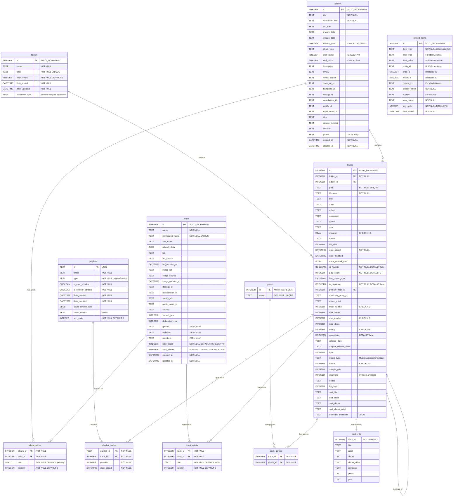

<h3>Chaparii</h3>

A personal offline music player for macOS & iOS

  

---

## Summary

**Chaparii** is a personal music player built on top of
[**Petrichor**](https://github.com/kushalpandya/Petrichor) (MIT). It plays my
`HiBy_R1_Music` library — roughly 1,400 tracks organized into language subfolders
with `.m3u8` playlists — synced to a HiBy R1 DAP, and runs on both macOS and iOS.

This is a personal project, not a general-purpose release: it's tuned for my own
library and workflow rather than distributed to end users.

### 🎵 Two apps, one shared core

- **macOS** (`Chaparii-Player`) — the full SwiftUI + AppKit app: browse, playlists,
  search, now-playing, favorites, tag editing, online tag lookup, and Spotify
  downloads via a bundled `spotdl`.
- **iOS / iPadOS** (`Chaparii-iOS`) — a deliberately trimmed companion: browse
  (Artist / Album / Genre / Folders), playlists, search, now-playing, favorites, and
  playback resume. **No tag editing, online lookup, or downloads.** Audio is ingested
  via iTunes File Sharing (copy audio + `.m3u8` into the app's Documents folder).

Both share `Models/` (GRDB records), `Managers/` (library/playlist/playback logic),
and `Core/` (metadata + playback engine). GRDB is the cross-platform library database.

### ✨ Features

- Wide audio format support: MP3, AAC/M4A, WAV, AIFF, ALAC, Ogg Vorbis, Speex, Opus,
  FLAC, APE, MPC, TTA, WavPack, DSF/DFF, plus MOD/IT/S3M/XM and AU.
- Map music folders and browse an organized library view.
- Create, import, and export playlists (including `.m3u8` auto-import on iOS).
- Folder-tree browsing, favorites, and go-to-artist / go-to-album navigation.
- Native macOS menubar and dock playback controls, plus dark mode.
- Handles large libraries with thousands of tracks; duplicate detection surfaces only
  the best copy of each track.

💡 **Tip**: Chaparii relies on tracks having good metadata for its features to work well.

### Requirements

- **macOS 14** or later
- **iOS 17** or later (simulator or device)

## 🏗️ Development

### Implementation overview

- Built with Swift and SwiftUI, with AppKit on macOS for native integration.
- On first run the app scans mapped folders, extracts metadata, and populates an
  SQLite database. It **never** alters your audio files — it only reads them.
- Track search uses [SQLite FTS5](https://www.sqlite.org/fts5.html).
- Playback runs through the [SFBAudioEngine](https://github.com/sbooth/SFBAudioEngine)
  backend (`MediaBackend.current`), with a macOS-only alternate backend.

See [`CLAUDE.md`](CLAUDE.md) for the full build/run flow, cross-platform structure, and
fork-specific gotchas, and [`docs/iOS-plan.md`](docs/iOS-plan.md) for the iOS scope.

View database schema

### Development setup

- macOS 14 or later, with [Xcode](https://developer.apple.com/xcode/) installed.
- Clone the repository and open `Chaparii-Player.xcodeproj`.
- Build the `Chaparii-Player` (macOS) or `Chaparii-iOS` scheme — see
  [`CLAUDE.md`](CLAUDE.md) for exact `xcodebuild` commands.

## Credits

Chaparii is a fork of [**Petrichor**](https://github.com/kushalpandya/Petrichor) by
Kushal Pandya, and stands on these open-source projects:

- [SFBAudioEngine](https://github.com/sbooth/SFBAudioEngine)
- [GRDB.swift](https://github.com/groue/GRDB.swift/)
- [Sparkle](https://github.com/sparkle-project/Sparkle)
- [spotDL](https://github.com/spotDL/spotify-downloader) (macOS downloads)

## 📝 License

- Chaparii and Petrichor are licensed under [MIT](LICENSE).
- Core dependencies (SFBAudioEngine, GRDB, Sparkle) are licensed under MIT.
- Audio codec libraries (FLAC, Vorbis, Opus, etc.) are dynamically linked and use
  various open-source licenses including GPL and LGPL.

For complete third-party license information, see [ACKNOWLEDGEMENTS.md](ACKNOWLEDGEMENTS.md).
